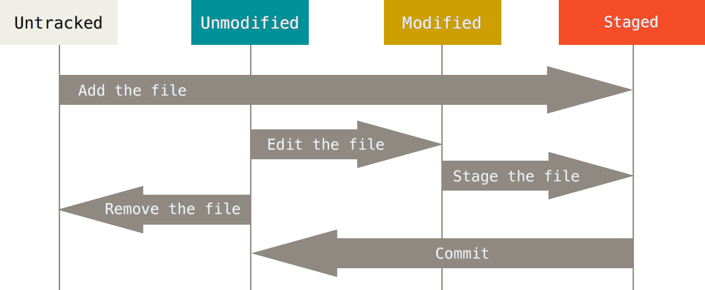

# Safety Nets & Recovery

---

## Learning Objectives

* <span class="fragment">Understand how Git protects against accidental mistakes and data loss</span>
* <span class="fragment">Learn the concepts behind Git's safety mechanisms and recovery strategies</span>
* <span class="fragment">Build confidence that "Someone deleted the codebase" can't happen again</span>

<!-- Set the tone: this is about confidence and recoverability. Emphasise: "Git is a safety net if you commit and push regularly." -->

---

## Git as a Safety Net

### The Problem (pre-Git)

* <span class="fragment">Accidental deletes / overwrites</span>
* <span class="fragment">Lost work after crashes</span>
* <span class="fragment">No visibility into *what changed* or *when*</span>

---

### Git's Solution

* <span class="fragment">Every commit is a snapshot you can return to</span>
* <span class="fragment">Full history + authorship</span>
* <span class="fragment">Multiple copies (local + remote)</span>
* <span class="fragment">Inspect exactly what changed and who changed it</span>

<!-- Contrast file shares/zip backups vs immutable commit history. "Snapshots not diffs" (conceptually) helps the audience trust rollback. -->

---

## States of Files

**Working Directory → Staging Area (Index) → Repository**

```
Untracked → Modified → Staged → Committed
```

* <span class="fragment">**Untracked**: file unknown to Git</span>
* <span class="fragment">**Modified**: changes not yet staged</span>
* <span class="fragment">**Staged**: changes queued for commit</span>
* <span class="fragment">**Committed**: durable in history</span>

---



<!-- Mental model: "in progress" (WD), "ready to photograph" (Index), "photograph taken" (Repo). Recovery maps to these states (next slide). -->

---

## Recovery Strategies (Concepts)

### Levels of Recovery

* <span class="fragment">**Working directory recovery** – restore uncommitted changes you're working on</span>
* <span class="fragment">**Staging area recovery** – undo what you've staged but not yet committed</span>
* <span class="fragment">**Commit recovery** – fix or undo commits you've already made</span>
* <span class="fragment">**History recovery** – find and restore "lost" commits from Git's history</span>

---

### Safety Mechanisms

* <span class="fragment">**Reflog** – log of *every* ref move</span>
* <span class="fragment">**Commit history** – snapshots forever</span>
* <span class="fragment">**Branch history** – "deleted" often recoverable</span>
* <span class="fragment">**Remote backups** – off-machine safety</span>

<!-- Stress "reflog saves the day" and "hard reset is last resort". Promise concrete commands in a later lab; today is the conceptual map. -->

---

## The `.git` Directory

* <span class="fragment">Stores the complete object database (blobs, trees, commits)</span>
* <span class="fragment">Tracks refs/branches/tags and the index</span>
* <span class="fragment">Deleted files that were committed still exist in objects</span>
* <span class="fragment">Treat it like a vault – don't manually edit internals</span>

<!-- If you can see it in history, you can usually get it back. Encourage frequent commits to populate the vault. -->

---

## Remote Repos as Backup

* <span class="fragment">Local **+** Remote ⇒ redundancy</span>
* <span class="fragment">Frequent pushes = off-site safety</span>
* <span class="fragment">Full recovery possible from remote if laptop is lost</span>

<!-- Tie to team norms: push early, push often. Mention protected branches as an extra safety layer. -->

---

## Common Scenarios (Concepts)

### "I deleted a file"

* <span class="fragment">If it was committed, it's recoverable from history</span>

---

### "Wrong changes committed"

* <span class="fragment">Undo the commit without losing work (soft/mixed)</span>

---

### "What changed?"

* <span class="fragment">Diff current vs past; see staged vs working; per-file history</span>

---

### "I've lost everything"

* <span class="fragment">Reflog to the rescue; remote clone as fallback</span>

<!-- Keep this high-level. Detailed commands appear later in the course. Encourage calm: "Don't panic. Git is designed to help you recover." -->

---

## Motivation & Confidence

### Why it matters

* <span class="fragment">Professionalism: recover fast, reduce downtime</span>
* <span class="fragment">Collaboration: transparent history builds trust</span>
* <span class="fragment">Continuity: durable project record</span>
* <span class="fragment">Experimentation: freedom to try, with rollback</span>

---

### Real-World Examples

* <span class="fragment">Deleted config → restore from a prior commit</span>
* <span class="fragment">Broken last commit → reset, fix, recommit</span>
* <span class="fragment">Need last week's changes → inspect history</span>
* <span class="fragment">Risky idea → branch, try, merge if good</span>

<!-- Reinforce: small, frequent commits = small, easy rollbacks. -->

---

## AI Assistant Integration

### When to Ask

* <span class="fragment">Clarify concepts (states, reflog, resets)</span>
* <span class="fragment">Choose recovery strategy for a scenario</span>
* <span class="fragment">Decode error messages</span>

---

### Prompt Examples

* <span class="fragment">"Explain Git's three-state model in simple terms."</span>
* <span class="fragment">"Which reset mode preserves my changes but removes the commit?"</span>
* <span class="fragment">"How does reflog help me find a lost commit?"</span>

<!-- Position AI as *guide*, not authority. Always validate changes locally. -->

---

## Key Takeaways

1. <span class="fragment">Git is a safety net when you commit and push</span>
2. <span class="fragment">Understand **Working Dir → Index → Repo**</span>
3. <span class="fragment">Multiple recovery paths (soft/mixed/hard, reflog)</span>
4. <span class="fragment">Remotes provide off-site backup</span>
5. <span class="fragment">Don't panic — data is rarely gone</span>
6. <span class="fragment">Learn the *why* first; the *how* is "straightforward"</span>

<!-- Close by previewing the hands-on recovery commands in the next section. -->
